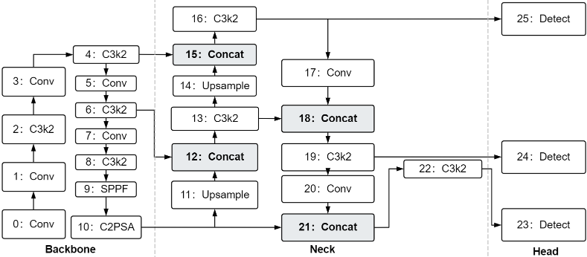
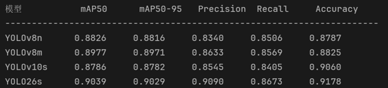
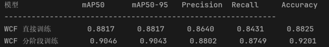
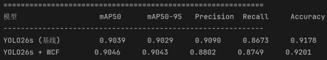

项目简介
针对生活垃圾图像检测任务，对比了 YOLOv8n/s、YOLOv10s、YOLO26s 等多个模型，并提出以下改进：
1. WCF模块（加权通道融合模块）：设计可学习加权通道融合模块，替代 YOLO 颈部网络的 Concat 拼接，提升多尺度特征融合能力
2. 分阶段训练策略：先冻结骨干网络预训练 WCF，再全参数微调，解决随机初始化破坏预训练权重的问题
3. Web端部署：基于 Flask 搭建识别系统，支持图片上传、拖拽、摄像头拍照识别及动态置信度调节







技术栈
框架：PyTorch 2.7 + CUDA 12.8 / Ultralytics YOLO 8.4.27 / Flask 2.3

语言：Python 3.9

图像处理：OpenCV、Pillow

工具：PyCharm、Git


项目结构

garbage-classification/
├── app.py                  # Flask 后端入口
├── train.py                # 模型训练脚本（根据需要的基线模型需改）
├── evaluate_baselines.py   # 基线模型评估
├── custom_modules.py       # WCF模块定义
├── static/                 # 前端静态资源
├── templates/              # HTML页面模板
└── garbage_dict.json       # 类别映射配置


```bash
# 1. 克隆项目
git clone https://github.com/2388783527-design/garbage-classification.git
cd garbage-classification

# 2. 安装依赖
pip install -r requirements.txt

# 3. 启动Web服务
python app.py
